

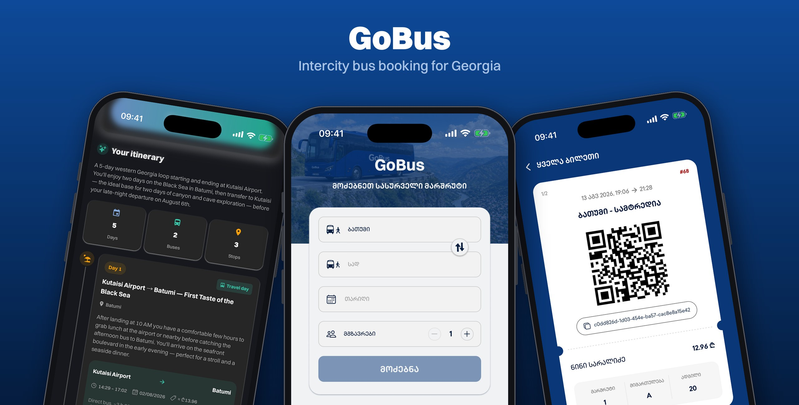

# 🚌 GoBus

**A full-stack mobile app for booking intercity bus trips in Georgia — search routes, pick your exact seat, pay by card, and travel with a QR ticket that works offline.**

Built end-to-end by Davit Bakuradze as a portfolio project.
Fully bilingual 🇬🇪 Georgian / 🇬🇧 English · Light & dark themes · iOS & Android (Expo / React Native)

> 🔒 **Source code** lives in a private repository — **read access is available on request**:
> [davit.bakuradze98@gmail.com](mailto:davit.bakuradze98@gmail.com)

---

## ✨ What it does

- 🔎 **Trip search** — direct **and transfer** itineraries between 40+ stations, with live seat availability.
- 💺 **Per-segment seat selection** — interactive bus layout; on transfer trips you pick seats for every leg.
- 💳 **Online card payments** — reserve-then-pay flow through the Flitt gateway; abandoned checkouts release their seats automatically, and double-booking a seat is impossible at the database level.
- 🎟️ **Digital QR tickets** — stored in-app and **available offline**.
- 🤖 **AI Trip Planner** — describe a trip in plain language (*"5 days: 2 on the Black Sea, 2 in the canyons…"*) and get a day-by-day itinerary where **every bus leg is a real, bookable departure** — powered by Claude with tool calling against the live schedule database.
- 🗺️ **Interactive station map**, favorites, recent searches, localized error handling — the small things done properly.
- 📶 **Offline-first** — cached tickets and data survive with no connection, including a full offline cold start.

## 📱 Screenshots

  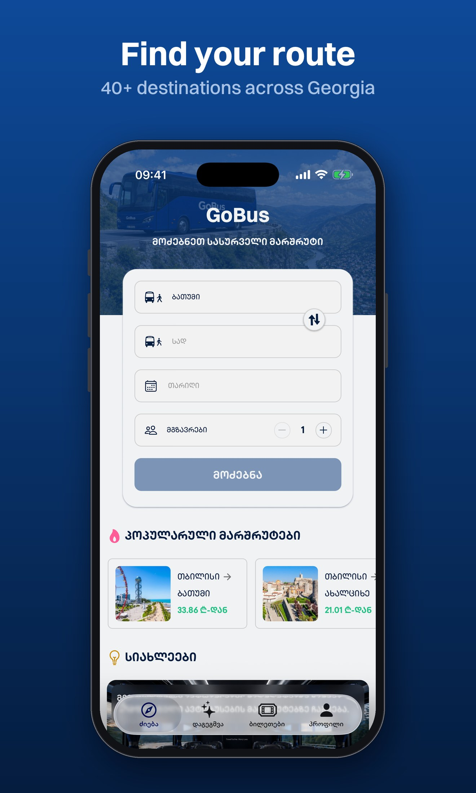
  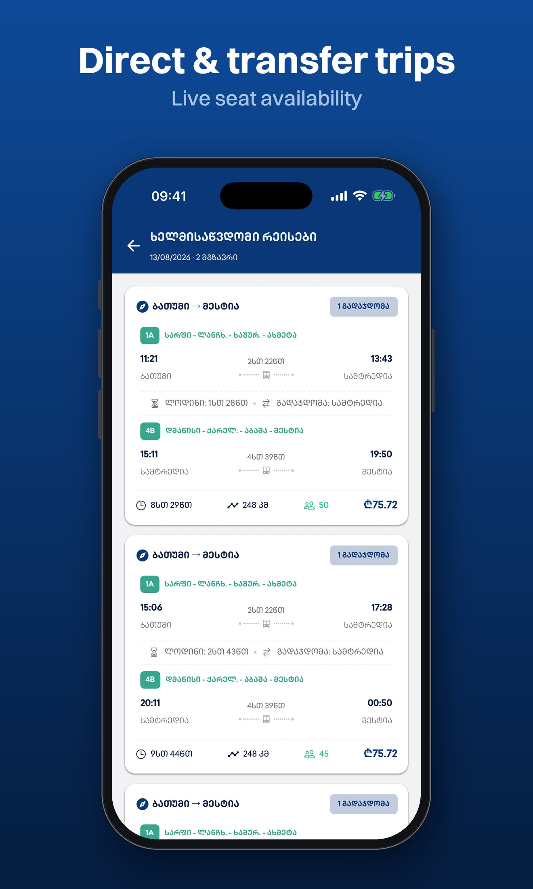
  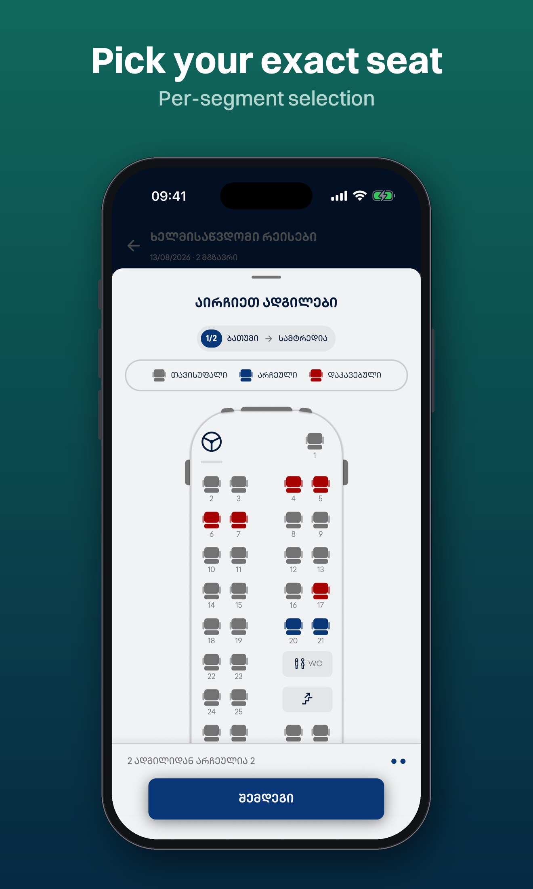

  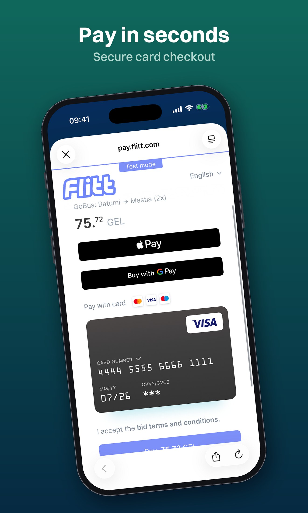
  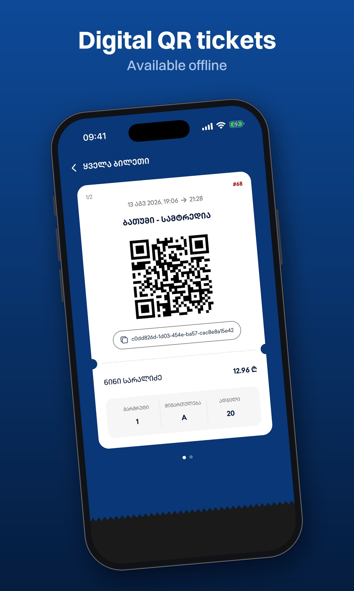
  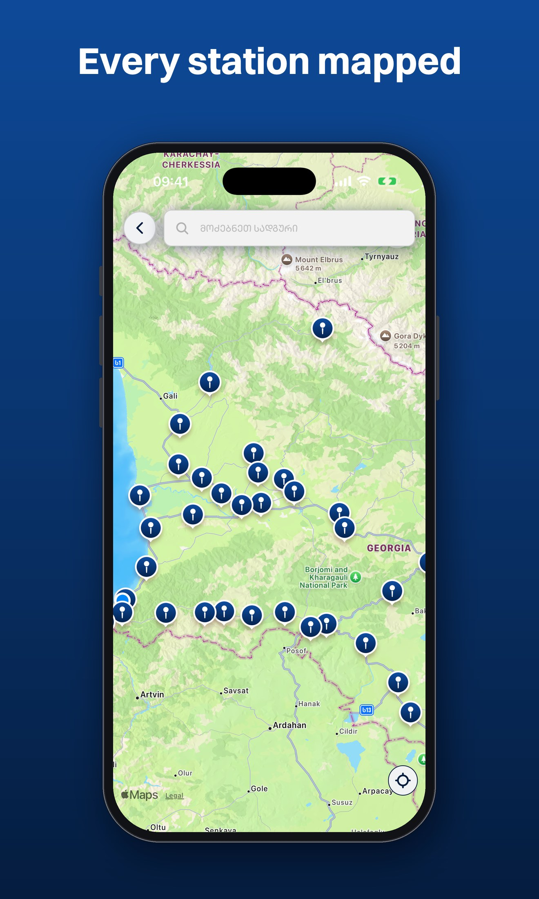

  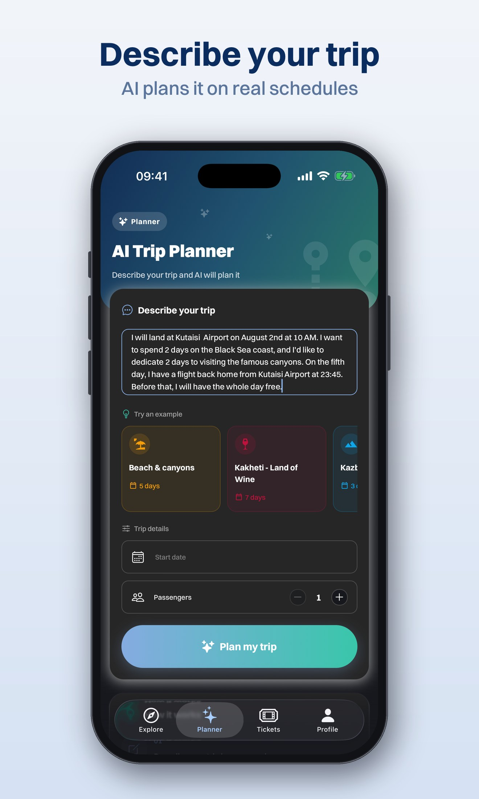
  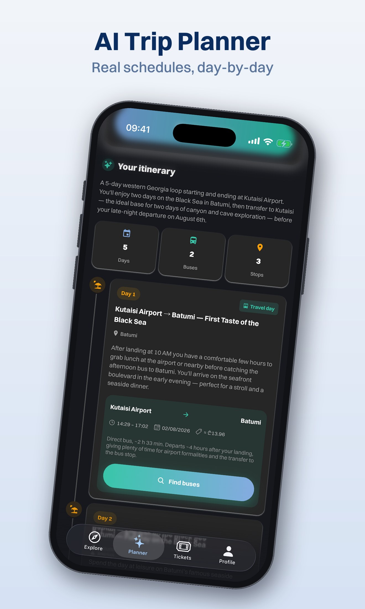
  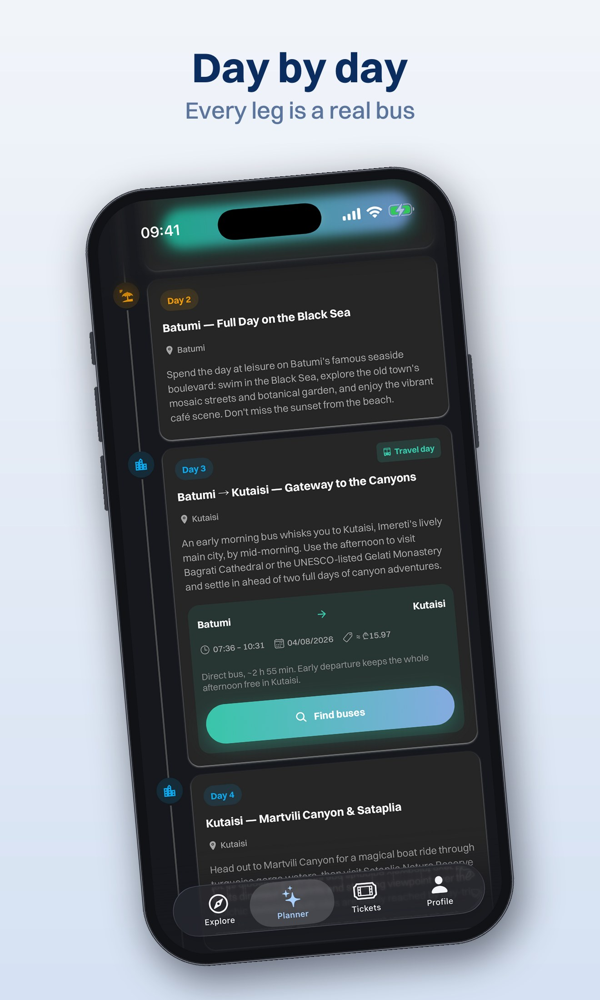

  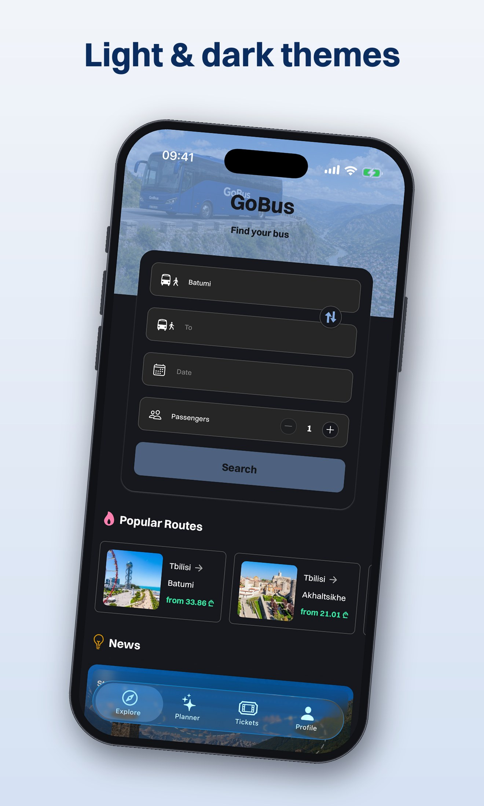
  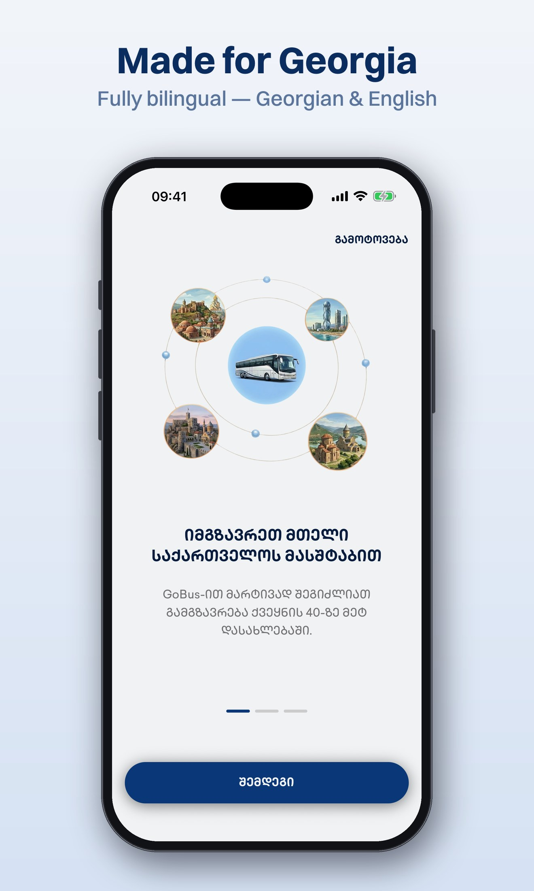
  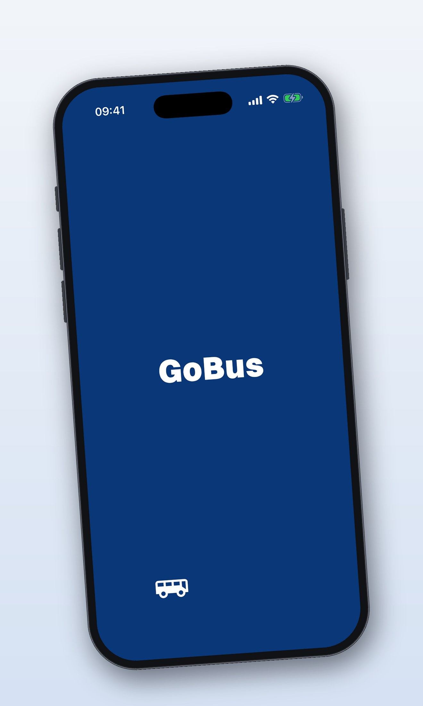

## 🎬 Demo video

*Coming soon.*

## 🛠️ How it's built

The entire stack — mobile client **and** backend — is one TypeScript codebase.

| Layer | Technology |
| --- | --- |
| **Mobile app** | React Native · Expo (Expo Router) · TypeScript · NativeWind (Tailwind) · Reanimated |
| **Backend** | Expo Router API routes on Node/Express, deployed on Render |
| **Database** | Neon serverless PostgreSQL · Drizzle ORM · exclusion constraint against seat double-booking |
| **Auth** | Clerk — JWT verified on every protected route |
| **Payments** | Flitt (hosted checkout, signed server-side, webhook + polling confirmation) |
| **AI** | Anthropic Claude API — tool-calling agent grounded in live schedules, with prompt caching |
| **Data & state** | TanStack Query (offline-first, MMKV persistence) · Zustand |
| **Security** | Arcjet (WAF, rate limiting, bot detection) · Zod validation on every payload |
| **i18n** | i18next — full Georgian / English localization, localized error codes |

Want to see the code, architecture docs, or discuss any of it? **Ask for access** — [davit.bakuradze98@gmail.com](mailto:davit.bakuradze98@gmail.com).

---

*GoBus is a portfolio project — not affiliated with any real company. All schedules and payments run against test data.*

Built with ❤️ in Georgia 🇬🇪

